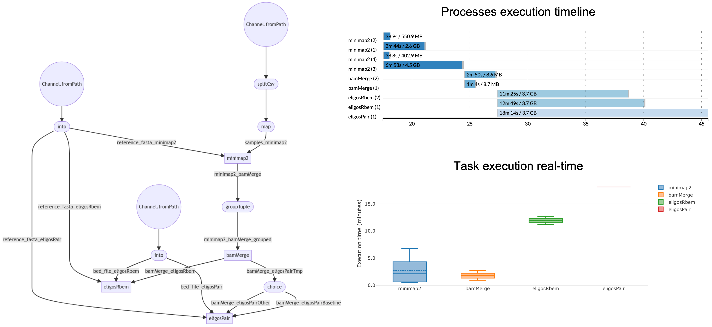

# nf-eligos
**nf-eligos** is a [Nextflow](https://www.nextflow.io) pipeline for modifications detection from Nanopore direct RNA-seq data based on [ELIGOS](https://gitlab.com/piroonj/eligos2). Starting from fastq files, it aligns the sequencing reads to a reference sequence with [minimap2](https://github.com/lh3/minimap2) and runs [ELIGOS](https://gitlab.com/piroonj/eligos2) for modifications detection based on the comparison to a baseline sample devoid of one or more modifications.

## Getting started

**Prerequisites**

* [Nextflow](https://nf-co.re/usage/installation)
* [Docker](https://docs.docker.com/engine/install/) or [Singularity](https://sylabs.io/guides/3.0/user-guide/installation.html)                                                                                  
                                                                                   
**Installation**

```
git clone https://github.com/MaestSi/nf-eligos.git
cd nf-eligos
chmod 755 *
```

## Overview

<p align="center">
  
</p>


## Usage

The nf-eligos pipeline requires you to open nf-eligos.conf configuration file and set the desired options. Then, you can run the pipeline using either docker or singularity environments just specifying a value for the -profile variable.

```
Usage:
        nextflow -c nf-eligos.conf run nf-eligos.nf --samples="/path/to/samples.txt" --resultsDir="/path/to/resultsDir" -profile docker

        Mandatory argument:
        -profile                                                 Configuration profile to use. Available: docker, singularity
        Other mandatory arguments which may be specified in the nf-eligos.conf file

        --samples                                                Path to the tab-separated sample file including sample name, condition and path to fastq file
        --baseline_condition                                     Condition to be considered as the baseling, must match one of the conditions in the samples file
        --min_depth                                              Minimum number of reads
        --max_depth                                              Maximum number of reads
        --spliced_alignment_flag                                 Flag for splice-aware alignment, set to true for genome alignment and to false for transcriptome alignment
        --min_mapq                                               Minimum mapping quality for filtering alignments
        --resultsDir                                             Path to a folder where to store results
        --reference_fasta                                        Path to the reference fasta file
        --bed_file                                               Path to regions of interest bed file
        --pval_thr                                               p-value threshold
        --adjPval_thr                                            adjusted p-value threshold
        --oddR_thr                                               Odds Ratio threshold
        --esb_thr                                                Threshold on %Error of Specific Bases to be considered for de novo motifs discovery
        --sb                                                     Selected basis for filtering modification of interest
        --opt_args                                               Other optional arguments (e.g. "-bcf <file.bcf> -m <model.json>")
```

## Citation

Please refer to the following manuscripts for further information:

Piroon Jenjaroenpun, Thidathip Wongsurawat, Taylor D Wadley, Trudy M Wassenaar, Jun Liu, Qing Dai, Visanu Wanchai, Nisreen S Akel, Azemat Jamshidi-Parsian, Aime T Franco, Gunnar Boysen, Michael L Jennings, David W Ussery, Chuan He, Intawat Nookaew, Decoding the epitranscriptional landscape from native RNA sequences. Nucleic Acids Research, 2020, gkaa620, https://doi.org/10.1093/nar/gkaa620

Intawat Nookaew, Piroon Jenjaroenpun, Hua Du, Pengcheng Wang, Jun Wu, Thidathip Wonsurawat, Sun Hee Moon, En Huang, Yinsheng Wang, Gunnar Boysen, Detection and discrimination of DNA adducts differing in size, regiochemistry and functional group by nanopore sequencing., Chemical Research in Toxicology, 2020, https://doi.org/10.1021/acs.chemrestox.0c00202

Li, H. (2018). Minimap2: pairwise alignment for nucleotide sequences. Bioinformatics, 34:3094-3100. doi:10.1093/bioinformatics/bty191
